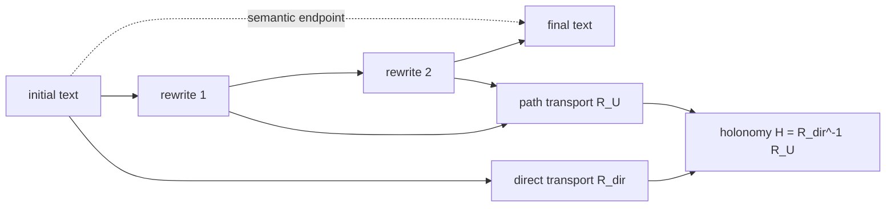

<p align="center">
  
</p>

<h1 align="center">Linguistic Holonomy</h1>

<p align="center"><em>Inner Geometry of Meaning-preserving Transformations.</em></p>

<p align="center">
  
  
  
  
</p>

Statistical text watermarks inhabit the freedom of the signifier: they mark choices of form that preserve meaning. This project studies what happens when a text is rewritten along a chain of meaning-preserving transformations. Its central proposal is geometric: two rewriting chains can share the same semantic endpoint and nevertheless differ by a measurable path residue, a **holonomy**.

The repository is the public research release accompanying the draft *Linguistic Holonomy and the Erosion of Statistical Watermarks*. It contains the manuscript, the exact proof certificates, runnable Python experiments, and immutable recorded outputs supporting the certified claims.

> [!IMPORTANT]
> This is a transparent work-in-progress snapshot dated 19 August 2026, not a submission package. The mathematical core and the synthetic detector experiments are certified; the real-text pilot is not yet large enough to execute the preregistered test. See [Research status](STATUS.md).

## The idea in one line

For a chain of embedded linguistic states, the loop rotation separates as

$$
R_{\mathcal U}=R_{\mathrm{dir}}H,
\qquad
H\in \operatorname{Stab}(v_0)\cong \mathrm{SO}(n-1).
$$

The endpoint statistic sees $R_{\mathrm{dir}}$; the path remembers $H$.



## What is established

| Result | Status | Evidence |
|---|---|---|
| The Sylvester signature of a linguistic-loop rotation degenerates to its rank; the angle spectrum is the finer invariant. | Proven | [Certificate A](certificates/Certificate_signature_degeneracy_v1.md) |
| The loop rotation is parallel transport and factors into endpoint transport and a holonomy in $\mathrm{SO}(n-1)$. | Proven | [Certificate B](certificates/Certificate_holonomy_factorization_v1.md) |
| For context-seeded watermarks, residual signal is controlled by the intact seeding windows; under independent retention it decays as $\rho^{h+1}$. | Proven under stated hypotheses; numerically verified | [Certificate C](certificates/Certificate_context_decay_v1.md) |
| The implemented detectors are calibrated against their synthetic nulls. | Verified, with explicit limitations | [Detector certificate](certificates/Certificate_detector_validation_v1.md) |
| Holonomy energy predicts residual detectability beyond retention and semantic deficit on real rewriting chains. | Not yet evaluable in the pilot | [Status and next steps](STATUS.md) |

## Explore the release

- **Article:** [read the draft PDF](output/pdf/Linguistic_Holonomy_draft_v1.pdf) or inspect the [LaTeX source](paper/Article_LLW_v1.tex).
- **Proof layer:** the four human-readable [certificates](certificates/).
- **Computational layer:** exact implementations in [scripts](scripts/) and lightweight regression tests in [tests](tests/).
- **Evidence:** immutable, hash-carrying [recorded runs](results/recorded/).
- **Provenance:** what was copied unchanged and what was adapted for GitHub in [PROVENANCE.md](PROVENANCE.md).

## Quick start

The geometry and synthetic detector experiments need only NumPy and SciPy:

```bash
python -m venv .venv
python -m pip install -r requirements-dev.txt
python -m pytest -q
python scripts/exp_geometry_v1.py
python scripts/exp_decay_v1.py
python scripts/exp_detector_validation_v1.py
```

Each experiment creates a new immutable directory under `results/runs/` with its outputs, log, environment, hashes, conclusions, and limitations.

The GitHub Actions workflow is included for pull requests and manual runs. Its first remote run could not start because GitHub reported an account-level billing lock; no remote test step executed. The same suite passes locally on Python 3.11. See [Research status](STATUS.md#automation-status).

The real-text pipeline additionally downloads language and translation models:

```bash
python -m pip install -r requirements-full.txt
python scripts/exp_corpus_v1.py --n-prompts 30 --max-new-tokens 180
python scripts/exp_indicators_v1.py
python scripts/exp_analysis_v1.py
```

The first full run downloads roughly 2.5 GB of model weights. The scripts run on CPU, although the larger study described in [STATUS.md](STATUS.md) will benefit substantially from a GPU.

## Scientific context

The construction develops the formalism introduced by D. Corradetti and A. Marrani in [*Linguistic Loops and Geometric Invariants as a Way to Pre-Verbal Thought?*](https://arxiv.org/abs/2503.23311). This repository corrects and refines the proposed signature invariant, identifies the loop rotation with spherical parallel transport, and connects the resulting path geometry to statistical text watermarking.

The draft deliberately makes no claim about undisclosed production watermarking systems. Its detector results concern the implemented green-list, Unigram, and context-seeded exponential families under the assumptions stated in the certificates.

## Citation and reuse

Citation metadata are provided in [CITATION.cff](CITATION.cff). No reuse license has been selected in this release; copyright remains with the author until a license is chosen explicitly.

## Author

**Daniele Corradetti**<br>
Grupo de Física Matemática, Instituto Superior Técnico, Lisbon<br>
Departamento de Matemática, Universidade do Algarve, Faro

---

<p align="center"><sub>Geometry for the path. Statistics for the trace. Reproducibility for the claim.</sub></p>
